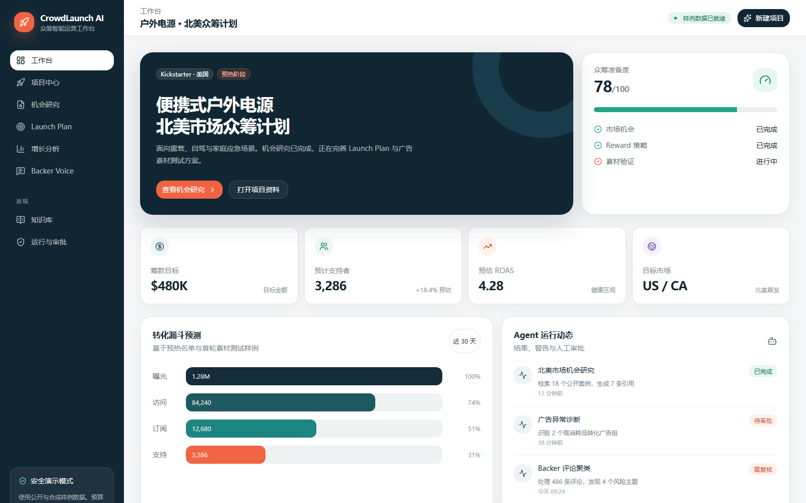
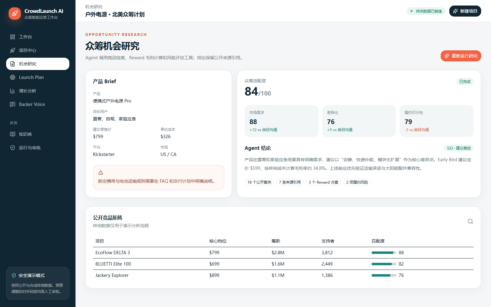
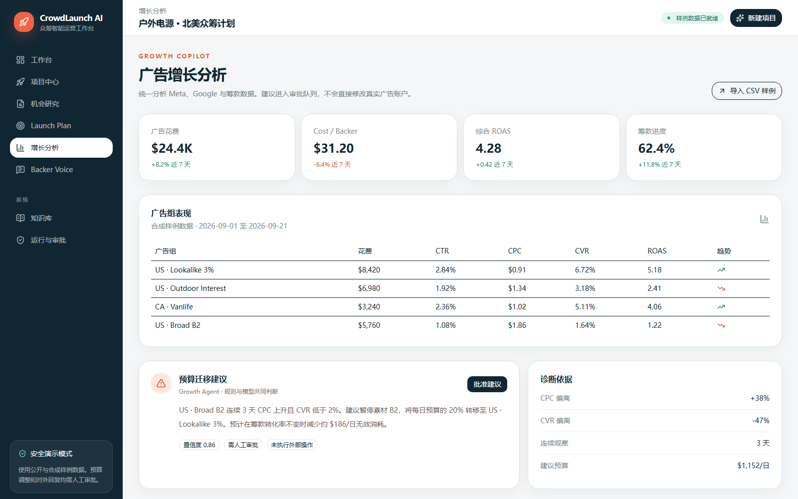
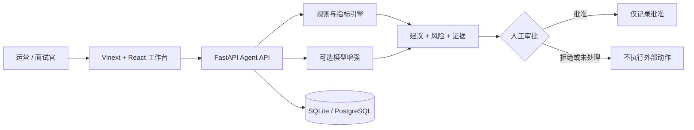

# CrowdLaunch AI

面向海外众筹营销团队的 AI Agent 工作台。它把竞品研究、回报档位设计、广告诊断、Backer 声音分析和人工审批放进同一条可审计工作流，帮助团队更快地从市场信号走到可执行决策。

> 作品集定位：这是一个针对 Kickstarter / Indiegogo 业务场景构建的可运行原型，不连接真实广告账户，也不会自动修改预算或向 Backer 发送消息。

## 为什么做这个项目

海外众筹项目的研究、上线和增长阶段通常分散在表格、广告后台、聊天工具和人工经验中。CrowdLaunch AI 用三个 Agent 串起关键环节：

1. **Opportunity Agent**：根据市场、平台、竞品证据和成本结构，计算回报档位毛利并给出 GO / ADJUST / STOP 建议。
2. **Growth Agent**：读取广告指标，识别高 CPC、低转化或预算错配，并生成预算迁移建议。
3. **Backer Voice Agent**：聚类 Backer 留言中的主题和风险，生成待审核回复草稿。

所有会影响外部系统的动作都停在人工审批门前；审批会留下记录，但演示版不会执行真实外部写入。

## 使用截图

### 1. 众筹运营工作台

统一展示筹款目标、支持者预测、ROAS、转化漏斗和 Agent 运行状态。



### 2. Opportunity Agent 机会研究

结合产品 Brief、竞品证据和成本结构，输出适配度、风险提示和可解释的推进建议。



### 3. Growth Agent 广告增长分析

汇总广告组表现，诊断 CPC 与 CVR 异常，并把预算迁移建议送入人工审批。



## 演示路径

建议按下面顺序完成一次 3 分钟演示：

1. 在「机会研究」运行分析，查看证据数、机会评分和回报档位毛利。
2. 在「Launch 计划」查看时间线、档位和本地化任务，然后批准内部计划。
3. 在「增长优化」查看广告异常诊断，把预算从低效广告组迁移到高效广告组并进行人工批准。
4. 在「Backer Voice」查看留言主题、风险和回复草稿，确认系统不会自动发送。
5. 在「运行记录」查看 Agent 输入、输出、警告和审批状态。

## 关键能力

- 中文运营驾驶舱，适配桌面和移动端
- 可解释的毛利、CPC、CVR、ROAS 等指标计算
- 竞品证据矩阵和风险提示
- 多阶段 Launch 计划与本地化清单
- 广告预算迁移建议及人工审批
- Backer 留言主题分析和回复草稿
- SQLite 审计记录；可切换 PostgreSQL
- 可选 OpenAI Responses API 增强，缺少 Key 或请求失败时自动回退
- WebMCP 工具，可从对话中导航视图、运行演示分析和批准建议

## 架构



更详细的边界和数据流见 [docs/architecture/README.md](docs/architecture/README.md)。

## 本地运行

### 1. 前端

需要 Node.js 22.13 或更高版本。

```powershell
npm ci
npm run dev
```

浏览器访问 `http://localhost:5173`。

### 2. 后端

需要 Python 3.11 或更高版本。

```powershell
cd backend
python -m pip install -r requirements.txt
python -m uvicorn app.main:app --reload
```

接口文档位于 `http://127.0.0.1:8000/docs`。

默认使用 `backend/crowdlaunch.db`。如需 PostgreSQL：

```powershell
docker compose up --build
```

### 3. 可选模型增强

复制 `.env.example` 中的变量到本地环境，并设置：

```text
MODEL_PROVIDER=openai
OPENAI_API_KEY=你的密钥
OPENAI_MODEL=你的模型名称
```

未设置、请求失败或返回格式异常时，`/api/model/enrich` 会回退到确定性结果。密钥不会写入仓库。

## 验证

```powershell
npm run build
npm run lint
cd backend
python -m pytest tests -q
```

当前自动化测试覆盖健康检查、机会研究、增长诊断、Backer 分析、审批幂等边界和模型回退。

## 安全与演示边界

- 演示数据为合成样例，不代表真实客户或真实 Campaign 结果。
- 系统不会连接 Meta Ads、Kickstarter 或 Indiegogo 账户。
- 所有预算变更、计划批准和回复发送都需要人工确认。
- 当前批准接口只写审计记录，返回 `external_action_executed: false`。
- 规则引擎负责可核验的数值计算；模型只用于文案和解释增强。

## 项目结构

```text
app/                         Vinext 页面入口与主题
components/                  交互式 Agent 工作台
backend/app/                 FastAPI、规则引擎、模型适配器、数据库
backend/tests/               API 与安全边界测试
data/samples/                广告指标和 Backer 留言样例
docs/architecture/           架构与业务边界
docs/interview-demo/         3 分钟面试演示脚本
docs/resume/                 简历项目描述候选稿
```

## 下一步可产品化方向

- 接入已授权的 Meta Ads / Google Ads 只读数据
- 接入客户知识库与历史 Campaign 复盘资料
- 增加证据引用、评测集和提示词版本管理
- 在审批后通过受控队列调用外部系统，并支持撤销和双人复核
