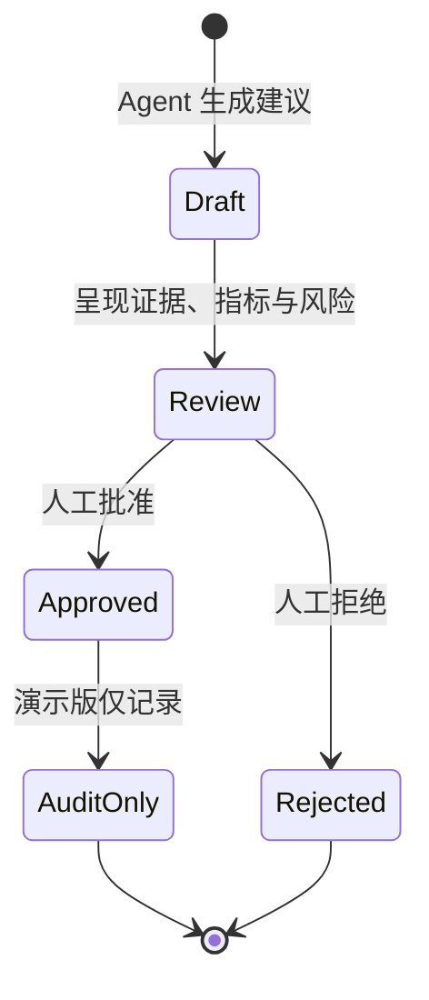

# 系统架构与业务边界

## 设计原则

CrowdLaunch AI 将“确定性计算”和“生成式增强”分开：成本、毛利、CPC、CVR、ROAS 等数字由规则引擎计算；大模型只负责摘要、解释和草稿。这使输出更容易复核，也便于在没有模型服务时继续工作。

## 数据流

1. 用户提交项目市场、平台、证据数、回报档位或广告指标。
2. FastAPI 使用 Pydantic 验证输入。
3. 规则引擎生成结构化指标、建议和警告。
4. 如启用模型增强，则把“任务 + 已计算结果”发送给模型；失败时保留原结果。
5. Agent 运行写入 SQLite 或 PostgreSQL，记录类型、项目、输入、输出、警告数和时间。
6. 对预算迁移、计划批准或回复发送等高影响动作，系统生成待审批项。
7. 演示版批准后只更新审计状态，不调用外部系统。

## 核心接口

| 方法 | 路径 | 用途 |
|---|---|---|
| GET | `/health` | 服务状态和外部写入状态 |
| POST | `/api/research` | 机会评分与回报毛利分析 |
| POST | `/api/growth/diagnose` | 广告异常和预算建议 |
| POST | `/api/backers/analyze` | Backer 主题、风险和回复草稿 |
| GET | `/api/runs` | 最近 50 次 Agent 运行记录 |
| POST | `/api/model/enrich` | 可选模型增强与自动回退 |
| POST | `/api/approvals/{id}` | 人工审批；不执行真实外部动作 |

## 人工审批边界

外部写入包括修改广告预算、上线 Campaign、发送 Backer 回复等。它们明确不属于当前原型的执行范围。

## 生产化差距

- 需要 OAuth、租户隔离、角色权限和密钥托管。
- 需要真实来源连接器、限流、重试、幂等和撤销机制。
- 需要离线评测集、线上反馈闭环和模型成本监控。
- 需要数据保留策略、PII 脱敏和操作审计导出。
